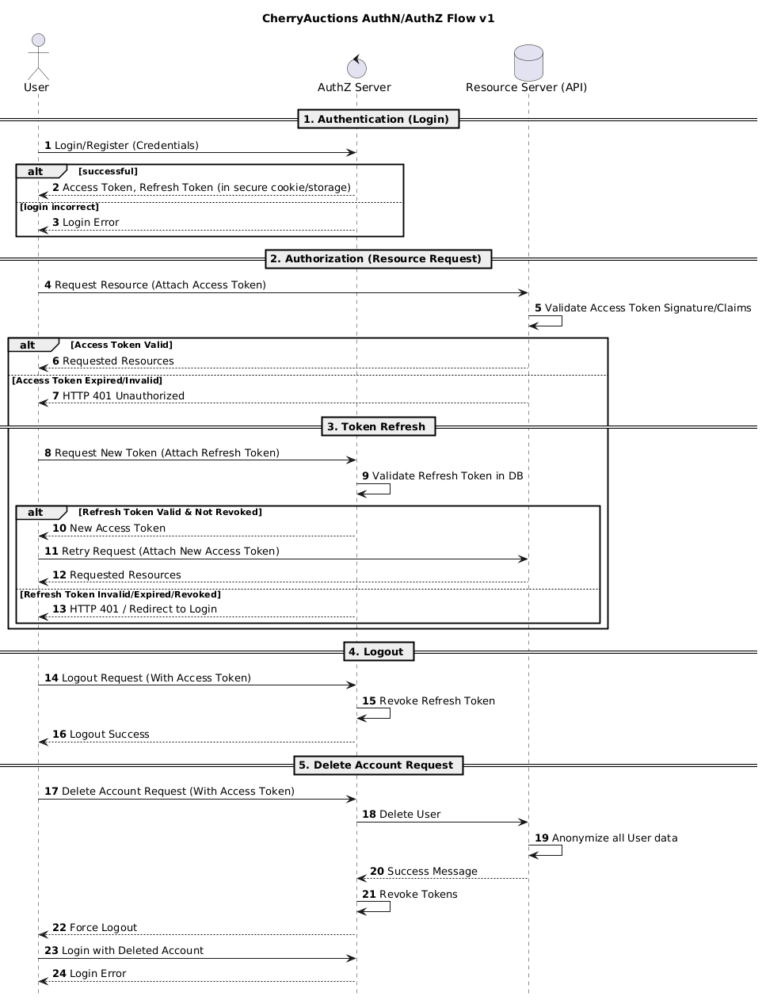

# Engineering Spec 01: Authentication and Authorization Flow

## Changelog

Current version: `v1`.

## Summary

This engineering specification concerns the full flow of authentication and
authorization for the app, is subjected to changes at any time during the
iterative process.

To recap, authentication section will concern the process of registering and
logging in, and how to properly save the user credentials as well as what to do
to adhere to OWASP best practices. Authorization section will concern the
process of validating and granting permissions to permitted resources after
logging in succeeded.

## User Flow

High-level user flow for the requirement to use "JWT Access Key / Secret Key"
as a mechanism.

## Authentication and Authorization

The mechanism above will be implemented using **PKCE**, or **Proof Key of Code
Exchange** under OAuth standards.

Reasons:

- This is a public key, it should be used in the frontend, which exposes everything,
  so a client secret is not possible. Same with mobile apps.
- PKCE provides strong protection against various mechanisms of stealing credentials,
  as well as also adheres strongly to the requirement for a JWT key pair.

### Preconditions

A Client ID should be registered directly on the backend for the SPA frontend to
use, but the method of how that can be registered is out of scope for this
specification.

The Client ID will be marked as `client_id` for the flow. The Client ID is an
opaque token, registered with the backend, that links itself with a `callback_uri`.
This `callback_uri` is the callback destination for the backend to redirect the
user to after authentication and authorization.

The Client ID and the Callback URI shall be different for each environment, such
as:

- `local-app` and `http://localhost:3000/callback` for Local Developers Environment.
- `stg-app` and `https://stg.example.com/callback` for Staging Environment.
- `prod-app` and `https://example.com/callback` for Production Environment.

Due to constrained resources, Staging Environment is T.B.D and may be omitted entirely
in the final project.

### Step 1. Client generates a Code Verifier

The public client may generate a code verifier, which has to satisfy the following:

- Must be cryptographically random using digits, ASCII characters, and special
  characters limited to `_`, `.`, `~` and `-`.
- Must have a minimum length of 43 characters after encoding in Base64 URL and a
  maximum length of 128 characters. This specification suggests 64 characters as
  the middle compromise, but it ultimately depends on the implementer.

### Step 2. Client generates a Code Challenge

Using the **code verifier**, the client creates a **code challenge** derived from
it.

There are two ways to generate a code challenge, ultimately depending on whether
the client has the means to do a SHA-256 hash. If it can, prefer it over using
plain text.

- If using `plain`, the `code_challenge` is exactly equal to the `code_verifier`.
- If using `s256`, the `code_challenge` can be computed by taking the sha-256
  hash of the ASCII version of `code_verifier`, and THEN apply a base64-url encode
  on the hash to get the code challenge.

The `plain` transformation is only meant for **integrating with legacy systems**.

### Step 3. Client sends an Authorization Request

The client must send an authorization request to the authorization server according
to RFC 6749 specifications. It must be a request, that conforms to the following:

- The request must use `application/x-www-form-urlencoded` format.
- The request body must contain the following fields:
  - `response_type` must be set to `code`.
  - `client_id` as required in the precondition.
  - `redirect_uri` as the URI to redirect to, should match exactly to the registered
    URI with the client.
  - `scope` (optional) as the scope of the client as registered with the client,
    can be omitted if we don't save the scope. Otherwise, it is a string of
    space-delimited scopes, where each scope is case-sensitive.
  - `state` (optional, but recommended) as an opaque value generated by the client
    to maintain some state between callbacks. The authorization server includes this
    value when sending back to the client, as this prevents Cross-Site Request
    Forgery.
  - `code_challenge` as the value generated from step 2.
  - `code_challenge_method` (optional), if omitted, the authorization server shall
    default to `plain`. Use `plain` or `s256` depending on what step 2 did to generate
    the code challenge.

#### Step 3A. If the request failed

In the cases that the request failed due to missing, invalid, or mismatching URIs,
or if the client ID (and/or secret) is missing or invalid, the authorization server
MUST NOT redirect to the configured redirect URI.

If the request fails for other reasons, it can be redirected, with the information
of what happened using `application/x-www-form-urlencoded` format:

- `error`: The type of error, must be an ASCII string from the following:
  - `invalid_request`: The request is missing a required parameter, includes an
    invalid parameter value, includes a parameter more than once, or is otherwise
    malformed.
  - `unauthorized_client`: The client is not authorized to request an authorization
    code using this method.
  - `access_denied`: The resource owner or authorization server denied the request.
  - `unsupported_response_type`: The authorization server does not support obtaining
    an authorization code using this method.
  - `invalid_scope`: The requested scope is invalid, unknown or malformed.
  - `server_error`: Server-side error. This is needed because a 500 HTTP code cannot
    be used as a redirect.
  - `temporarily_unavailable`: The authorization server is currently overloaded or
    down for maintenance. Similar reason to `server_error` as 503 HTTP code cannot
    be used as a redirect.
- `error_description` (Optional): Human-readable value of what that error code means.
- `state` (REQUIRED if the request contained one): Exact value received.

The error code that will be used mostly would be `invalid_request` and `unauthorized_client`,
as others are not commonly encountered in our use case. This may be subjected to
be changed in the future.

### Step 4. The Server Callbacks

**IMPORTANT!** When the server generates an authorization code to be sent back to
the client, it must have a way to associate the code challenge and the code
challenge method with the code to be verified later.

This specification recommends appending such data into the code and encrypt it
so that it can be re-verified later on the server side with the key, but storing
it in a database or a safe cache to associate them is also a viable option. The
server **MUST NOT** include the `code_challenge` in ANY OTHER form that a malicious
client can extract.

The exact method to use is _undefined_ for the specification RFC 7636.

The lifetime of the authorization code must be saved somewhere, that it has a
maximum of TEN MINUTES, no more.

### Step 5. Client requests a token

The client can now request a token from the authorization server on a token
endpoint using `application/x-www-form-urlencoded` format. Includes the
following:

- `grant_type` must be SET to `authorization_code`.
- `code` must be SET to the code received from the authorization server, also
  called the authorization code.
- `redirect_uri` must be SET to exactly the same string as the one registered
  with the server.
- `client_id` must be SET to the client for that public SPA.
- `code_verifier` must be SET to the original verifier the SPA generated. This
  is to help the authorization server verifies the code embedded inside the
  `authorization_code`. This verifier is NOT hashed.

### Step 6. Server verifies code verifier before sending back a token

The server extracts the `code_challenge` out of the authorization code received
from the client, and compares it based on the `code_challenge_method` also embedded
into the authorization code:

- If the method is plain, a direct string comparison may take place:
  `code_verifier == code_challenge`.
- If the method is s256, the received "code verifier" is hashed with s256, base64-url
  encoded and then compared to the `code_challenge`.

#### Step 6A. The server verifies successfully

The server now sends back a set of tokens as requested by the client, using a 200
HTTP status code.

- `access_token`: The short-lived token issued by the authorization server to authenticate
  and authorize with the resource server.
- `token_type`:
- `expires_in` (recommended): The lifetime in seconds of the access token. If omitted,
  the authorization server must document somewhere about this lifetime. Recommended
  to be 3600.
- `refresh_token` (optional): The refresh token that can be used to generate a
  new access token as described below.
- `scope` (optional): Not implemented in our system. Subject to change.

#### Step 6B. The server failed to verify

The server fails to verify the codes, and return it as a 400 HTTP status response,
with the following body:

- `error`:
  - `invalid_request`: The request has a missing parameter, includes an unsupported
    parameter value, repeats one, or have multiple mismatched credentials.
  - `invalid_client`: The client authentication failed (unknown client, no suitable
    authentication method if for private clients). The authorization server may
    return this as a 401 HTTP code.
  - `invalid_grant`: The provided grant type, such as authorization code is not
    supported, or the refresh token is invalid, revoked or expired.
- `error_description` (optional): Human-readable version of the above error types.

### Step 7. The client requests a resource

When the client requests a resource, it uses only the access token, as the resource
server does not have authority over the refresh token.

For the web application, the access token and the refresh token may be returned
as HTTP only cookies, instead of saving somewhere else like `localStorage`. For
mobile apps, using technologies like iOS Keychain to store such tokens is valid.
