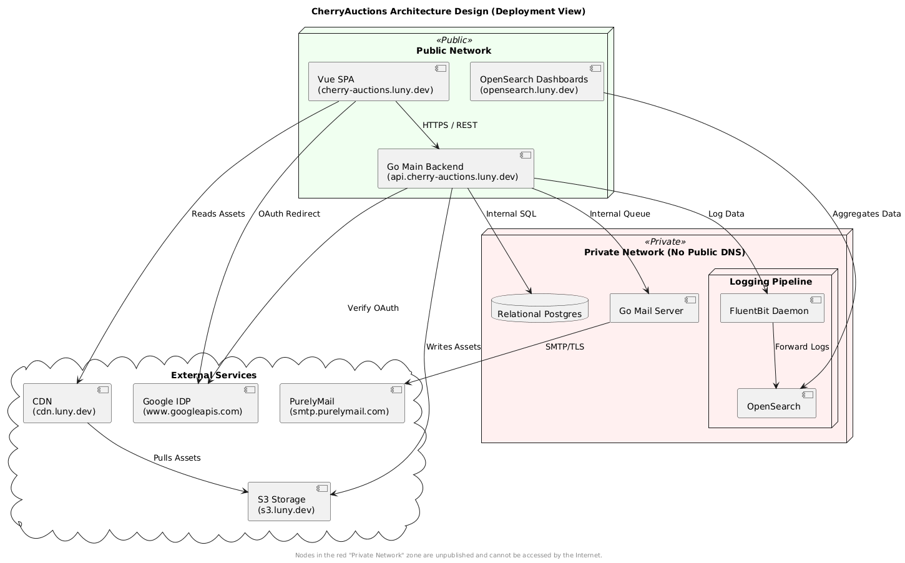

# Engineering Spec 03: Architecture Design

## Changelog

### v2.1 (Current)

- Changed the DNS name of OpenSearch Dashboards from
  `opensearch.cherry-auctions.luny.dev` to `opensearch.luny.dev`.

### v2

- Added technologies required by the SRS:
  - A logging and searching stack, recommended to be Elasticsearch, Kibana and
    Logstash, but chosen OpenSearch, OSD and FluentBit.
  - A mailing system.
  - Google Oauth.
  - A place to store images, product assets.

## Summary

This document concerns the logical overview of the application's architecture,
including networking.

In scope topics:

- Deployment Tactics
- Project Structure
- Networking and DNS

## Core Technology Stack

Disclaimer: This `core technology stack` section was summarized by an LLM with
my architecture design in PlantUML (Google Gemini).

| Domain Name                    | Service Component     | Access Level | Purpose                                                      |
| :----------------------------- | :-------------------- | :----------- | :----------------------------------------------------------- |
| `cherry-auctions.luny.dev`     | Vue SPA               | Public       | Primary web interface for end-users.                         |
| `api.cherry-auctions.luny.dev` | Go Main Backend       | Public       | REST API endpoint for frontend/mobile clients.               |
| `opensearch.luny.dev`          | OpenSearch Dashboards | Restricted   | Internal dashboard for log analysis and monitoring.          |
| `cdn.luny.dev`                 | CDN                   | Public       | Edge-cached delivery of static assets (images/blobs).        |
| `s3.luny.dev`                  | S3-compliant Service  | Private      | Origin storage for system-generated and user-uploaded files. |
| `www.googleapis.com`           | Google IDP            | External     | Third-party OAuth 2.0 Identity Provider.                     |
| `smtp.purelymail.com`          | SMTP Server           | External     | Third-party mail relay for outgoing notifications.           |

### Frontend (Client Layer)

- **Vue.js SPA:** The primary user interface hosted at `cherry-auctions.luny.dev`.
  It handles user interactions and consumes the RESTful business logic from the backend.
- **OpenSearch Dashboards:** A specialized visualization interface
  (`opensearch.cherry-auctions.luny.dev`) used for administrative monitoring and
  log analysis.

### Backend (Application Layer)

- **Go Main Backend:** A high-concurrency API built in Go that serves as the
  central orchestrator for business logic and database queries.
- **Go Mail Server:** An internal service dedicated to processing email queues,
  ensuring that the main API is not blocked by SMTP latency.

### Data & Storage

- **PostgreSQL:** The primary relational database for structured business data
  (users, auctions, bids).
- **S3-Compliant Storage:** Used for persistent object storage of assets (images,
  attachments).
- **CDN (Content Delivery Network):** Caches and delivers assets from S3 to the
  frontend to minimize latency and reduce direct load on the storage bucket.

### Logging & Observability

The project features a dedicated **Logging Pipeline** to ensure system health is
transparent and searchable:

- **FluentBit:** Operates as a daemon to collect log data directly from the Go Backend.
- **OpenSearch:** Receives forwarded logs from FluentBit to index them for
  high-speed searching.
- **Logging Database:** Provides the underlying storage for indexed logs and telemetry.

### External Integrations & Security

- **Google IDP:** Handles secure authentication via OAuth 2.0. The frontend
  authorizes the user, while the backend verifies the requests.
- **Purelymail SMTP:** The external relay used for reliable email delivery.
- **Network Isolation:** As per the system design, any node without a dedicated
  DNS name (e.g., Postgres, Mail Server, FluentBit) is isolated from the public
  internet, accessible only within the internal network.

